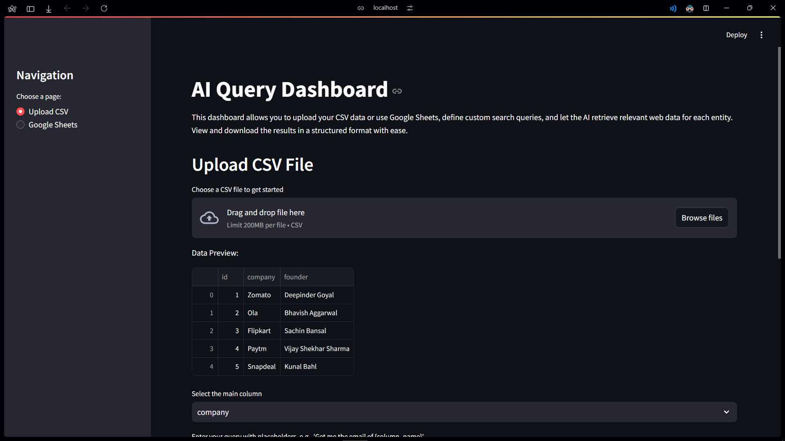
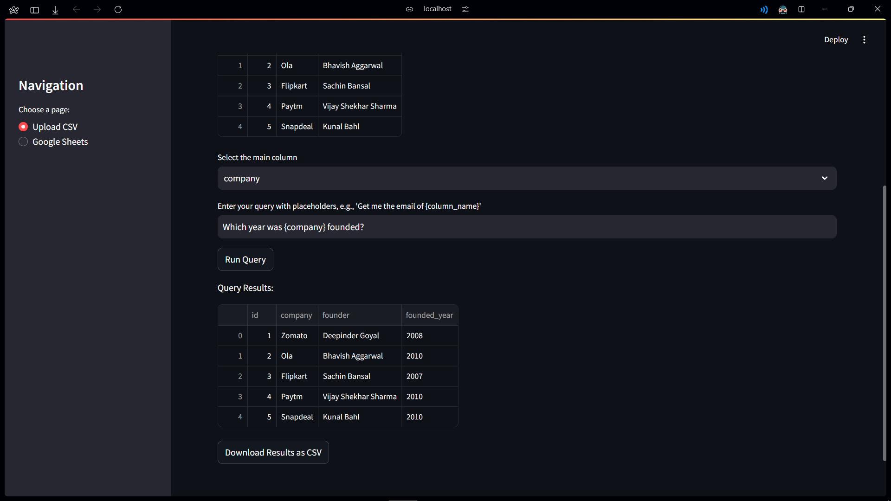
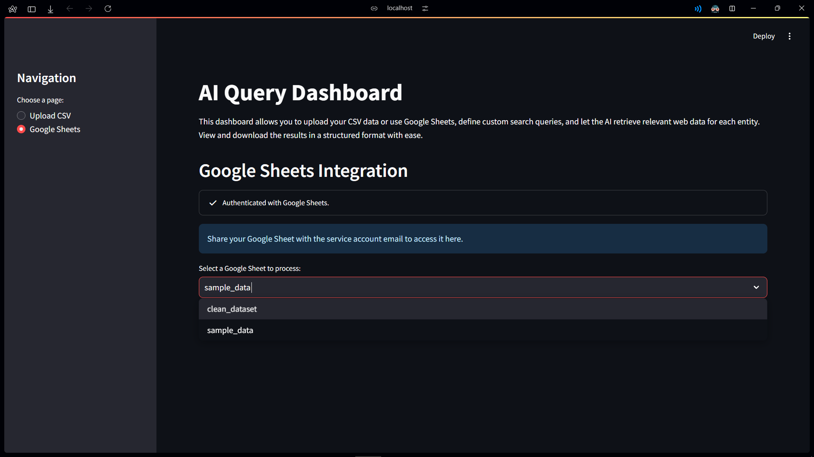
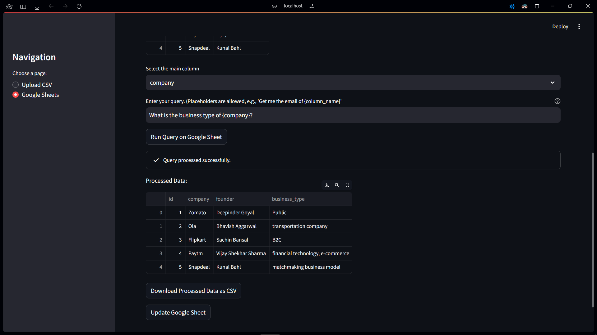

# AI Query for Structured Data using Web Scraper

## Table of Contents
1. [Introduction](#introduction)
2. [Key Features](#key-features)
3. [Frameworks](#frameworks)
4. [Pipeline Flowchart](#pipeline-flowchart)
5. [Setup Instructions](#setup-instructions)
    - [Manual Setup](#1-manual-setup)
    - [Docker Compose Setup](#2-docker-compose-setup)
6. [Google Sheets Integration](#google-sheets-integration)
    - [Steps to Enable Google Sheets and Google Drive API](#steps-to-enable-google-sheets-and-google-drive-api)
    - [Creating a Service Account](#creating-a-service-account)
7. [Setting up Environment Variables](#setting-up-environment-variables)
8. [Dashboard UI](#dashboard-ui)

## Introduction
This is an end-to-end tool that allows users to automate data retrieval from the web, preprocess and filter results, scrape content, extract relevant context, and structure the data in a user-friendly format. The dashboard integrates various AI-powered and web scraping capabilities, and it allows users to define custom search queries to retrieve the most relevant data from online sources.

## Key Features
1. **Web Scraping and Filtering:** Automates Google search, URL filtering, and content scraping.
2. **Webpage Parsing:** Parses both HTML and PDF content to extract relevant context.
3. **Contextual Data Retrieval:** Uses embeddings to retrieve and structure relevant data.
4. **Asynchronous Processing:** Improves efficiency for large datasets.
5. **Google Sheets Integration:** Supports importing spreadsheets from Google Sheets.

## Frameworks
- **Backend:** Python
- **API:** FastAPI
- **UI:** Streamlit
- **Data Handling:** Pandas
- **Google Sheets Integration:** [gspread](https://pypi.org/project/gspread/)
- **Web Search:** Custom Google Search Module
- **Web Scraping:** Beautiful Soup, PyPDF2, ~~Newspaper4k~~ ([Newspaper4k](https://github.com/AndyTheFactory/newspaper4k) results in better scraped data but takes more time)
- **LLM:** OpenAI (gpt-4o-mini) (Use "gpt-4o" for better consistency)
- **Agents:** Langchain

## Pipeline Flowchart
[](https://app.eraser.io/workspace/ppoyn1JCW4ovoj4aMwC8?elements=ljSFRrRDGOUB2yuJRALU0g)

## Setup Instructions
Prerequisites:
- Python 3.10 or higher
- Pip

Clone the repository:
```bash
git clone https://github.com/suryanshgupta9933/breakoutai-assesment.git
cd breakoutai-assesment
```

### 1. Manual Setup

1. Create and Activate a Virtual Environment
    ```bash
    python -m venv venv
    source venv/bin/activate
    ```

2. Install the required dependencies:
    ```bash
    pip install -r requirements.txt
    ```

3. Start the Application
    - **Run the FastAPI Backend**
        ```bash
        python routes.py
        ```
    - **Run the Streamlit Dashboard**
        ```bash
        streamlit run dashboard.py
        ```

### 2. Docker Compose Setup

This setup uses Docker Compose and requires minimal configuration.
Prerequisites:
- Docker

1. Build and run the Docker containers:
    ```bash
    docker-compose up --build
    ```

2. Access the Streamlit dashboard at `http://localhost:8501`.

## Google Sheets Integration
In current Implementation, Google Sheets Integration is supported using Service Account.
A service account is a special type of Google account intended to represent a non-human user that needs to authenticate and be authorized to access data in Google APIs.

> **Note:** Since it’s a separate account, by default it does not have access to any spreadsheet until you share it with this account. Just like any other Google account.

### Steps to Enable Google Sheets and Google Drive API
1. Head over to the [Google Cloud Console](https://console.cloud.google.com/) and create a new project(or select an existing one).
2. Search for `APIs & Services` in the search bar and click on `Enable APIs and Services`.
3. Search for `Google Sheets API` and click on `Enable`.
4. Search for `Google Drive API` and click on `Enable`.

> **You have successfully enabled the Google Sheets API and Google Drive API for your project.**

### Creating a Service Account

5. Go to `APIs & Services` > `Credentials` and click on `Create Credentials`.
6. Select `Service Account` and fill in the details.

> **Note:** Copy the `Service Account Email ID`. You will share your Google Sheets to this account.

7. Press on: near recently created service account and select `Keys` and then click on `Add Key` > `Create new key`.
8. Select JSON key and press `Create`.
9. Your Service Account JSON Key will be downloaded.

## Setting up Environment Variables
1. Rename the `.env.example` file to `.env` and update the environment variables.
    ```plaintext
    UPLOAD_ENDPOINT="http://localhost:8000/upload-csv"
    PIPELINE_ENDPOINT="http://localhost:8000/pipeline"
    OPENAI_API_KEY="your-openai-api-key"
    SERVICE_ACCOUNT_KEY="path/to/your/service-account-key.json"
    ```
2. Add your OpenAI API Key and path to your Service Account JSON Key to the `.env` file.

> - **You have successfully set up Google Sheets Integration.**
Share your Google Sheets with the Service Account Email ID and you are good to go.

## Dashboard UI
### CSV Upload



### Google Sheets


