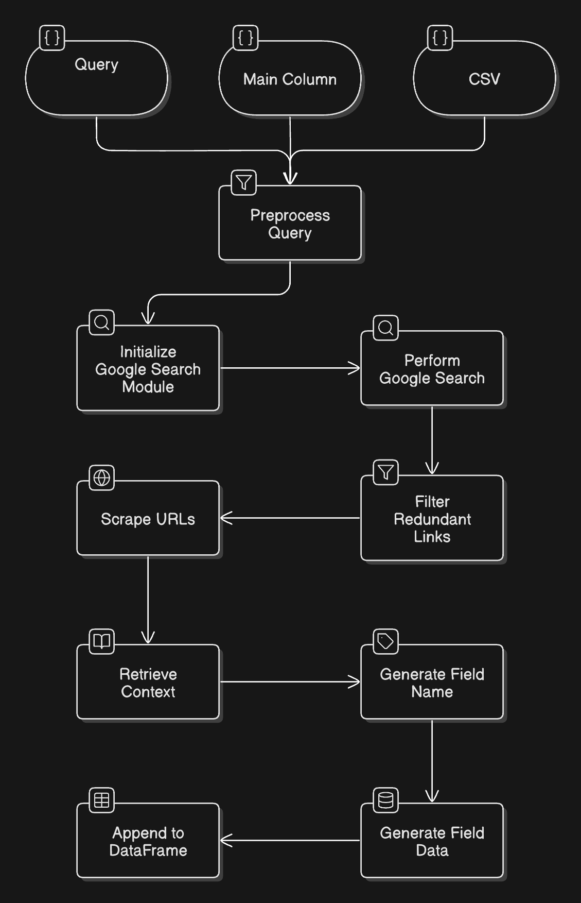

# AI Query for Structured Data using Web Scraper

## Table of Contents
1. [Introduction](#introduction)
2. [Pipeline Flowchart](#pipeline-flowchart)

## Introduction
This is an end-to-end tool that allows users to automate data retrieval from the web, preprocess and filter results, scrape content, extract relevant context, and structure the data in a user-friendly format. The dashboard integrates various AI-powered and web scraping capabilities, and it allows users to define custom search queries to retrieve the most relevant data from online sources.

## Key Features
1. **Web Scraping and Filtering:** Automates Google search, URL filtering, and content scraping.
2. **Webpage Parsing:** Parses both HTML and PDF content to extract relevant context.
3. **Contextual Data Retrieval:** Uses embeddings to retrieve and structure relevant data.
4. **Asynchronous Processing:** Improves efficiency for large datasets.
<!--4. **Google Sheets Integration:** Supports importing queries from Google Sheets.-->

## Pipeline Flowchart


## Setup Instructions
Prerequisites:
- Python 3.10 or higher
- Pip

1. Clone the repository:
    ```bash
    git clone https://github.com/suryanshgupta9933/breakoutai-assesment.git
    cd breakoutai-assesment
    ```

2. Set Up Environment Variables
Rename the `.env.example` file to `.env` and update the environment variables.
    ```plaintext
    UPLOAD_ENDPOINT="http://localhost:8000/upload-csv"
    PIPELINE_ENDPOINT="http://localhost:8000/pipeline"
    OPENAI_API_KEY="your-openai-api-key"
    ```

### 1. Manual Setup

1. Create and Activate a Virtual Environment
    ```bash
    python -m venv venv
    source venv/bin/activate
    ```

2. Install the required dependencies:
    ```bash
    pip install -r requirements.txt
    ```

3. Start the Application
    - **Run the FastAPI Backend**
        ```bash
        python routes.py
        ```
    - **Run the Streamlit Dashboard**
        ```bash
        streamlit run dashboard.py
        ```

### 2. Docker Compose Setup
Prerequisites:
- Docker

1. Build and run the Docker containers:
    ```bash
    docker-compose up --build
    ```
